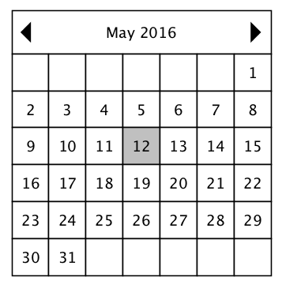
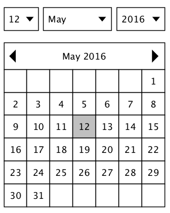

Test 2 - Javascript / ReactJS
=============================

Cet exercice a pour but d'évaluer votre niveau dans le développement d'une application web en Javascript.

Objectif
--------

L'objectif est de créer un composant calendrier en [React](https://facebook.github.io/react/) avec les caractéristiques suivantes :

-   La première colonne représente le lundi
-   Chaque ligne représente une semaine
-   Il est possible d'afficher le mois précédent avec la fèche vers la gauche
-   Il est possible d'afficher le mois suivant avec la fèche vers la droite
-   Par défaut, le mois courant est affiché
-   Par défaut, le jour courant est mis en évidence

Si vous avez le temps, créez un formulaire qui permet de changer la date courante.

Consignes
---------

-   Vous devez rendre un fichier `index.html` qui affichera le composant fonctionel.
-   Il n'y a pas de contrainte sur les outils utilisés pour l'écriture du composant
